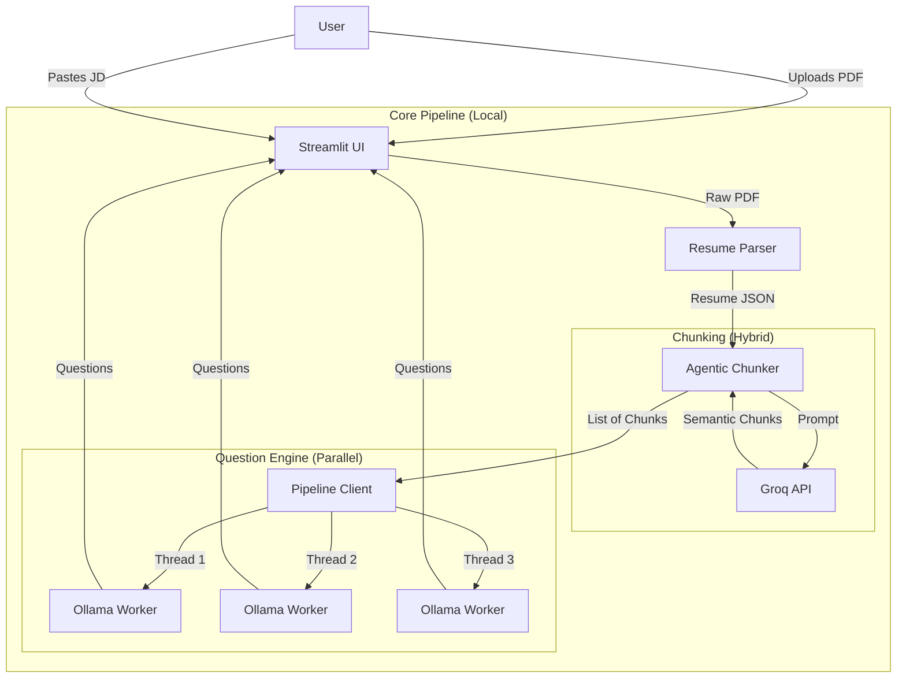

# System Architecture: RAG Interview Docket

## Overview
**RAG Interview Docket** is a local-first, AI-powered tool designed to assist technical interviewers. It analyzes a candidate's resume against a provided Job Description (JD) and generates targeted, level-aware interview questions using a retrieval-augmented generation (RAG) approach.

## Technology Stack
-   **Frontend/UI**: [Streamlit](https://streamlit.io/)
-   **Local LLM Inference**: [Ollama](https://ollama.ai/) (Model: `qwen2.5`)
-   **Cloud LLM (Chunking)**: [Groq](https://groq.com/) (Model: `llama3-70b-8192` or similar high-speed model)
-   **PDF Parsing**: `pdfplumber`
-   **Orchestration**: Python `concurrent.futures` for parallel processing

## High-Level Data Flow



## Component Details

### 1. UI Layer (`ui/`)
-   **`layout.py`**: The main application container. Handles the `st.status` streaming updates and coordinates the generation flow.
-   **`components.py`**: Reusable UI widgets (headers, file uploaders) and the complex rendering logic for nested question data.
-   **`state.py`**: Manages Streamlit session state (persisting parsed resume and generated questions across reruns).

### 2. Core Logic (`core/`)

#### A. Resume Parser (`core/parser/`)
-   **`resume_parser.py`**: Uses `pdfplumber` to extract text and heuristic regex patterns to identify sections (Skills, Experience, Projects).
-   **Output**: A structured dictionary containing raw text categorized by section.

#### B. Agentic Chunker (`core/chunker/`)
-   **`chunker.py`**: Uses Groq's fast inference to analyze the resume against the JD. It breaks the resume down into "Skills" and key "Claims".
-   **Output**: A list of `ResumeChunk` objects (e.g., "Python Experience", "System Design").

#### C. Question Engine (`core/question_engine/`)
-   **`engine.py`**: The "Brain". Takes a single claim, classifies it (e.g., Optimization, Design), and prompts the local LLM (Ollama) to generate 7 specific types of questions.
-   **`generator.py`**: The Orchestrator. Flattens the chunks into individual claims and uses a `ThreadPoolExecutor` to run the `engine.py` logic in parallel (default: 3 workers). Yields results incrementally for UI streaming.
-   **`classifier.py`**: Helper to tag claims with metadata.
-   **`dedup.py`**: Logic to remove redundant questions.

### 3. Pipeline Controller (`core/pipeline_client.py`)
-   Replaces the traditional HTTP backend.
-   Coordinates the flow: `Parser -> Chunker -> Generator`.
-   Exposes `generate_questions_local` as a generator function for streaming support.

## Data Structures

### Resume Chunk (Intermediate)
```json
{
  "chunk_id": "chunk_python_123",
  "focus_skill": "Python",
  "claims": [
    { "claim_text": "Built a scalable API...", "source_section": "Experience" }
  ]
}
```

### Final Output (UI Model)
```json
[
  {
    "focus_skill": "Python",
    "results": [
      {
        "claim": "Built a scalable API...",
        "claim_type": "IMPLEMENTATION",
        "questions": [
          { "level": "clarification", "question": "..." },
          { "level": "depth_tradeoff", "question": "..." }
        ]
      }
    ]
  }
]
```
